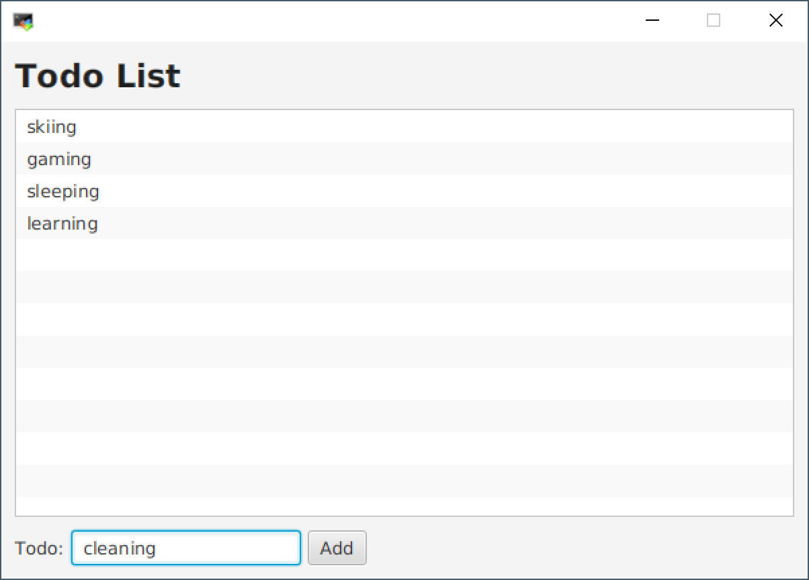

# Todo List

Erstellen Sie eine JavaFX-Applikation der dargestellten GUI:

Die GUI soll folgende Funktionen unterstützen:

- Hinzufügen eines neuen TODO-Eintrags durch Anklicken des `Add`-Buttons
- Hinzufügen eines neuen TODO-Eintrags durch Drücken der `ENTER`-Taste
- Entfernen des in der `ListView` ausgewählten TODO-Eintrags durch Drücken der `DELETE`-Taste

Dabei soll sich die Applikation folgendermaßen verhalten: 
 - Nachdem ein Eintrag zur `ListView` hinzugefügt wurde, soll die `TextBox` wieder leer sein.
 - Falls die `TextBox` leer ist, sollen der `Add`-Button und die `Enter`-Taste wirkungslos bleiben.
 - Falls die `ListView` leer ist, soll die `DELETE`-Taste wirkungslos bleiben.

